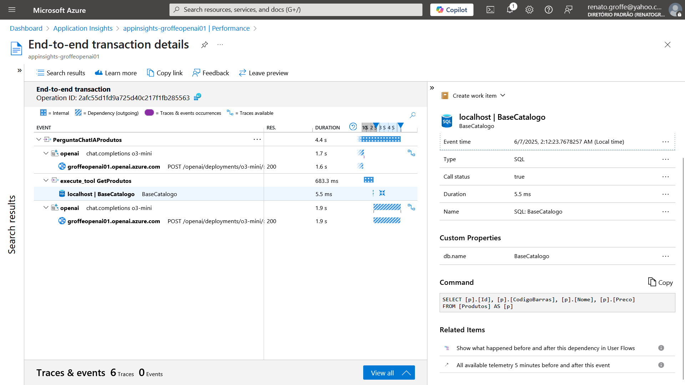
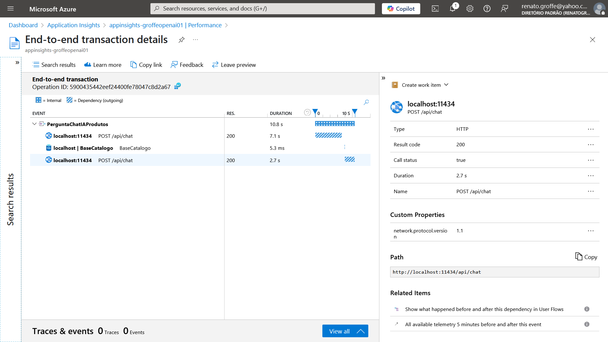

# dotnet9-semantickernel-sqlserver-otel-azureappinsights_consultaprodutos
Exemplo em .NET 9 de Console Application que faz uso do projeto Semantic Kernel, com integração com soluções de IA como Azure Open AI e Ollama na consulta de informações de produtos em uma base SQL Server. Inclui Docker Compose para criação do ambiente de testes com os dados + monitoramento com Application Insights/Azure Monitor.

---

## Traces

Exemplo de trace gerado utilizando Azure OpenAI:

Outro exemplo de trace, desta vez usando Ollama localmente:

